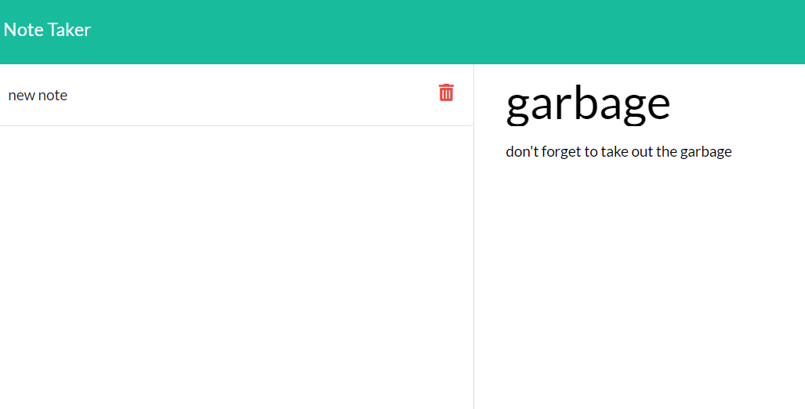

# notePadApp

## 

## Table Of Contents

*[Description](#Description)

*[installation](#Installation)

*[requirements](#requirements)

*[Usage Instructions](#Usage-Instructions)

*[Running the tests](#Running-the-tests)

*[Contributing](#Contributing)
## Description
This is a note taking application that allows a user to input a note title and note text , and then save those notes to view later. The user can view and delete the notes in addition to adding new notes.
    
## Installation
    
this project is a node application, there for if you are looking to develop using this project you must have node.js installed as well as all dependencies which in this case is only express.js
    
## Requirements
    
the application it's self runs in the browser and for basic use all that is required for use is a web browser that can run basic web applications.
## Usage Instructions

To use this project clone the repository to your local system , navicate to the application directory and run node app.js. this will initialize the node server. Once the node server is running open your browser and navigate to  localhost:3001 then you can start adding notes and using the application.
    
## Running the tests
    
there are no tests associated with this project at the moment
    
## Contributing
    
if you would like o contribute to this project you are encouraged to submit a pull request or for larger changes contact the project creator

## Additional questions
contact the creator at jdlevish@gmail.com or jdlevish on github.com

## licensing
this project is covered under the MIT License for more info view the  [license.txt](/license.txt)
    